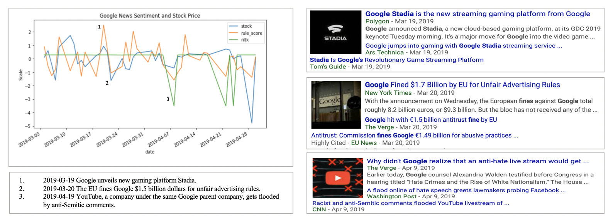
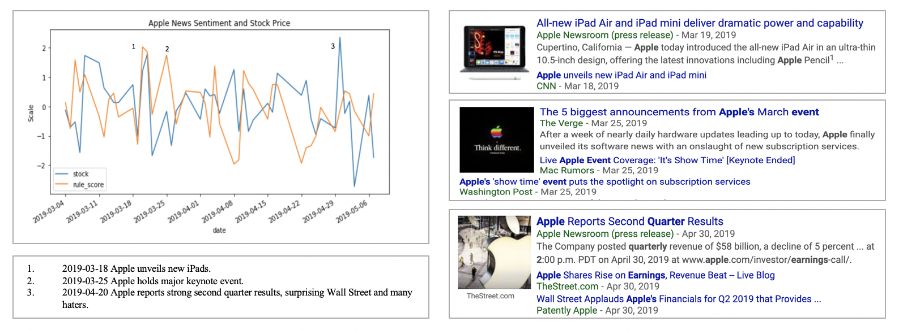

# Predicting Stock Through News Articles 
Jonathan Cai, William Su

 

## Motivation

We've always been somewhat interested in both the financial world and new natural language processing technologies. Thinking about how we could explore the intersection between these two, we read many interesting articles and research reports online about people using Twitter data to predict stock pricing, most notably [Dr. Bollen's popular research paper](https://arxiv.org/pdf/1010.3003.pdf), and people doing similar things with sentiment analysis (
[an attempt at algorithmic trading based on news sentiment](https-towardsdatascience-com-algorithmic-trading-using-sentiment-analysis-on-news-articles-83db77966704), 
[Dr. Bing Liu of UIC's work on opinion mining](https-towardsdatascience-com-algorithmic-trading-using-sentiment-analysis-on-news-articles-83db77966704)).

We thought it might be cool to try to generate a sentiment score based on news articles (specifically New York Times because they provide a rather useful [API](https://developer.nytimes.com/indexV2.html)), rather than tweets. 

There are many glaring differences between these data sources, Twitter vs NYT, mainly in that tweets seem to be more of indicative of how the general populace feels (at least theoretically), especially because tweets come from millions and millions of users. 
On the other hand, New York Times articles are curated and published through a reputable source, making its way though several vetting filters, editors. 
Tweets are also composed of 280 (previously 140) characters, whereas news articles can sometimes become 10-20 minute reads.
Maybe we can see whether a machine can more accurately read into the sentiment of longer vs shorter pieces of text.
Lastly, the diction of these two sources of text are very different. A news writer uses far more formal and mature language as compared to the average Twitter troll. This verbosity provided in news article may give more accurate insight into the performance of a company.

Maybe, as a result of these differences, news article could provide a sense of sentiment that correlates better with the movement of the stock market?

## Data Mining

For our goals, we needed to retrieve data on 1. the news articles, and 2. the stock price movements.

As mentioned previously, we utilized the [New York Times API](https://developer.nytimes.com/indexV2.html) to gather all of the news articles. Specifically, we used their "Article Search API" to get links to each of the articles, and then queried the website itself to get the individual articles' paragraphs and words. For this pre-processing, we mainly utilized Pandas DataFrames, containing information on each article's url, date, and list of words.

As for the stock data, we used [AlphaVantage](https://www.alphavantage.co/documentation/). 
We queried their API, stored the data into Pandas DataFrames, 
and then calculated the change in the stock price (delta) for each day, because we weren't interested in each stock price data point itself, we are interested in how much they change over time.
There was also added complexity, in that the stock exchange does not operate on weekends. To compensate for the missing weekend data points, we simply used the change of the stock price from the previous Fridays to the following Monday.
We then merged this stock data with the NYT article data based on the publication date and the stock delta for the corresponding day. 

At the end of our pre-processing, for each company, we had a  DataFrame with the index as the dates, one column for our single feature, the list of words in the article for that date, and then one column for our label, the change in the stock price for that day.

In total, for each company, we generated about 1800 data points over the period of around 150 days.

## Sentiment Analysis Techniques

We tried to use the following techniques to generate some sentiment score for each article in our dataset:

#### NLTK

[NLTK](http://www.nltk.org/) is free open-source tool which "provides a practical introduction to programming for language processing". One of its nice features is a module for sentiment analysis. In particular, they have a tool called their VADER (Valence Aware Dictionary for sEntiment Reasoning) SentimentIntensityAnalyzer, which takes in a piece of text, and spits out its own sentiment score, composed of four scores: negative, neutral, positive, and composite (a compound of the previous three). The only issue for our project, however, is that this lexicon-based sentiment analyzer is based on sentiment data derived from humans rating short pieces of texts through Amazon Mechanical Turk. As a result, it appears to be more ["focused on social media and short texts unlike Financial News which are almost the opposite"](https://towardsdatascience.com/https-towardsdatascience-com-algorithmic-trading-using-sentiment-analysis-on-news-articles-83db77966704).

#### Building our own lexicon

#### TextBlob

#### Neural Network

## Results

## Considerations

Not all of the articles retrieved actually relate to the company queried.