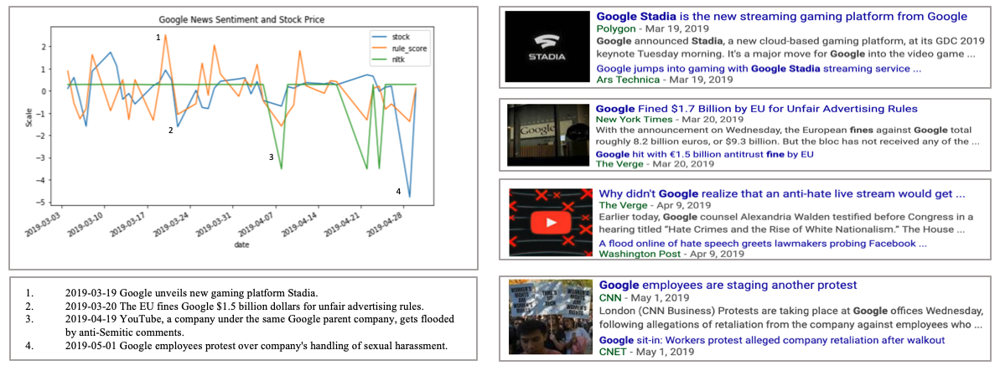
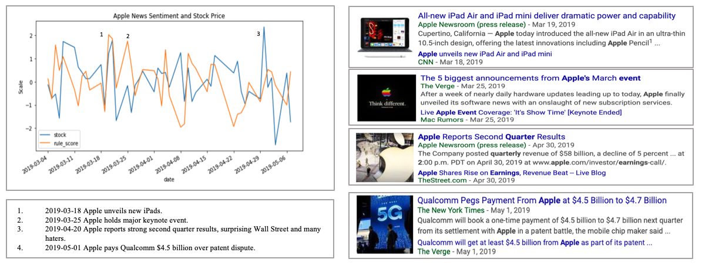
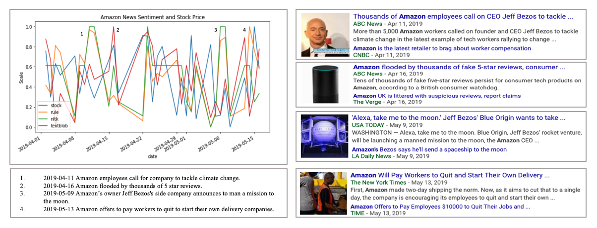
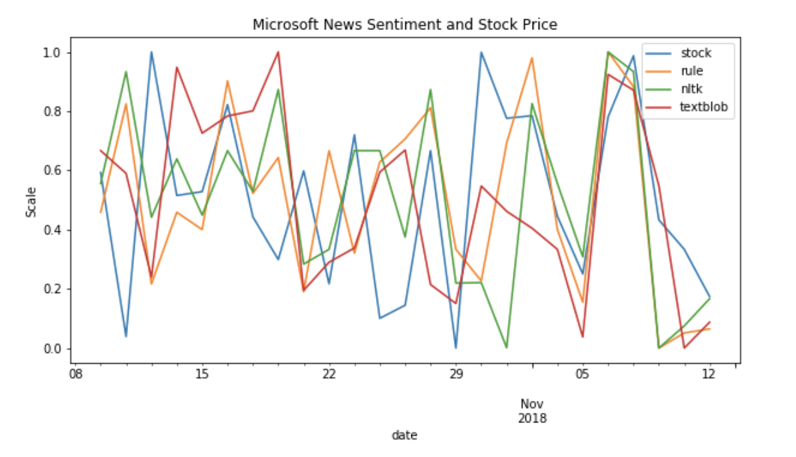
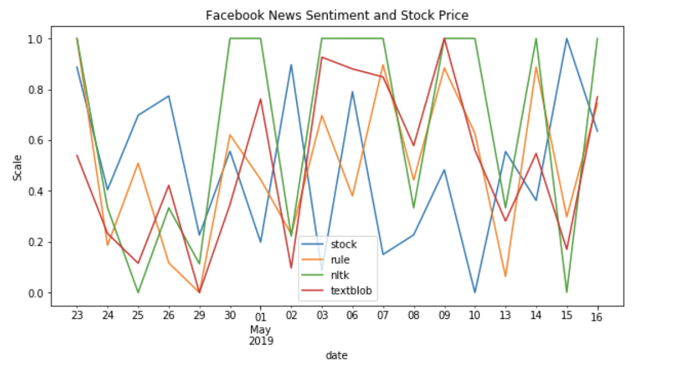
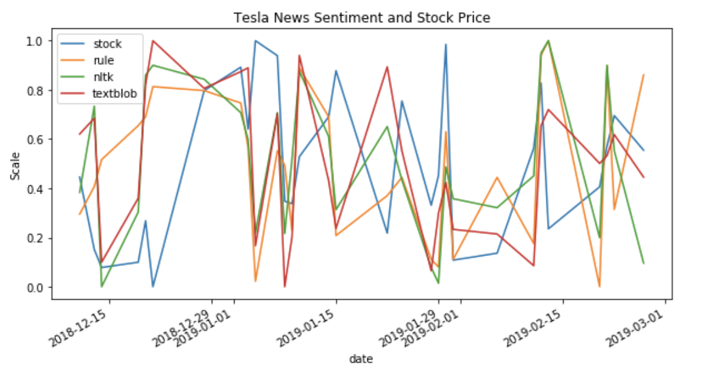

# Predicting Stock Through News Articles 
Jonathan Cai, William Su

 

 
## Motivation

We've always been somewhat interested in both the financial world and new natural language processing technologies. Thinking about how we could explore the intersection between these two, we read many interesting articles and research reports online about people using Twitter data to predict stock pricing, most notably [Dr. Bollen's popular research paper](https://arxiv.org/pdf/1010.3003.pdf), and people doing similar things with sentiment analysis (
[an attempt at algorithmic trading based on news sentiment](https-towardsdatascience-com-algorithmic-trading-using-sentiment-analysis-on-news-articles-83db77966704), 
[Dr. Bing Liu of UIC's work on opinion mining](https-towardsdatascience-com-algorithmic-trading-using-sentiment-analysis-on-news-articles-83db77966704)).

We thought it might be cool to try to generate a sentiment score based on news articles (specifically New York Times because they provide a rather useful [API](https://developer.nytimes.com/indexV2.html)), rather than tweets. 

There are many glaring differences between these data sources, Twitter vs NYT, mainly in that tweets seem to be more of indicative of how the general populace feels (at least theoretically), especially because tweets come from millions and millions of users. 
On the other hand, New York Times articles are curated and published through a reputable source, making its way though several vetting filters, editors. 
Tweets are also composed of 280 (previously 140) characters, whereas news articles can sometimes become 10-20 minute reads.
Maybe we can see whether a machine can more accurately read into the sentiment of longer vs shorter pieces of text.
Lastly, the diction of these two sources of text are very different. A news writer uses far more formal and mature language as compared to the average Twitter troll. This verbosity provided in news article may give more accurate insight into the performance of a company.

Maybe, as a result of these differences, news article could provide a sense of sentiment that correlates better with the movement of the stock market?

## Data Mining

For our goals, we needed to retrieve data on 1. the news articles, and 2. the stock price movements.

As mentioned previously, we utilized the [New York Times API](https://developer.nytimes.com/indexV2.html) to gather all of the news articles. Specifically, we used their "Article Search API" to get links to each of the articles, and then queried the website itself to get the individual articles' paragraphs and words. For this pre-processing, we mainly utilized Pandas DataFrames, containing information on each article's url, date, and list of words.

As for the stock data, we used [AlphaVantage](https://www.alphavantage.co/documentation/). 
We queried their API, stored the data into Pandas DataFrames, 
and then calculated the change in the stock price (delta) for each day, because we weren't interested in each stock price data point itself, we are interested in how much they change over time.
There was also added complexity, in that the stock exchange does not operate on weekends. To compensate for the missing weekend data points, we simply used the change of the stock price from the previous Fridays to the following Monday.
We then merged this stock data with the NYT article data based on the publication date and the stock delta for the corresponding day. 

At the end of our pre-processing, for each company, we had a  DataFrame with the index as the dates, one column for our single feature, the list of words in the article for that date, and then one column for our label, the change in the stock price for that day.

In total, for each company, we generated about 1800 data points over the period of around 150 days.

## Sentiment Analysis Techniques

We tried to use the following techniques to generate some sentiment score for each article in our dataset:

#### NLTK

[NLTK](http://www.nltk.org/) is free open-source tool which "provides a practical introduction to programming for language processing". One of its nice features is a module for sentiment analysis. In particular, they have a tool called their VADER (Valence Aware Dictionary for sEntiment Reasoning) SentimentIntensityAnalyzer, which takes in a piece of text, and spits out its own sentiment score, composed of four scores: negative, neutral, positive, and composite (a compound of the previous three). The only issue for our project, however, is that this lexicon-based sentiment analyzer is based on sentiment data derived from humans rating short pieces of texts through Amazon Mechanical Turk. As a result, it appears to be more ["focused on social media and short texts unlike Financial News which are almost the opposite"](https://towardsdatascience.com/https-towardsdatascience-com-algorithmic-trading-using-sentiment-analysis-on-news-articles-83db77966704).

#### Textblob

[Textblob](https://textblob.readthedocs.io/en/dev/quickstart.html) is another simple interface which performs sentiment analysis, providing both a polarity (-1 to 1) and a subjectivity score (0 to 1). Behind the scenes, Textblob holds a lexicon in XML format, containing entries on thousands upon thousands of words. It works by averaging the polarity scores among all words of the text being analyzed, and accounts for negation and modifier words too. All in all, Textblob doesn't appear to be too sophisticated a tool, and you can see the results below to see for yourself how it performed.

#### Building our own lexicon, a rule-based algorithm

On top of these previous two lexicon-based tools, we also decided to try and build out our own lexicon of words. Admittedly, a lot of the hard work was already performed by others, as we used dictionaries from [Loughran and McDonald Sentiment Word Lists](https://sraf.nd.edu/textual-analysis/resources/#LM%20Sentiment%20Word%20Lists) which contain thousands of pre-labeled positive and negative words. Also, we used data from the [MPQA Subjectivity Lexicon](http://mpqa.cs.pitt.edu/lexicons/subj_lexicon/) provided by OpinionFinder.
We simply combined words from each of these sources, and selected the first 2500 words from both positive and negative words. We defined our rule-based algorithm to simply count the occurence of the total positive and negative words, and subtract to come up with a final sentiment score.

#### Neural Network

Another solution we explored is the extent to which a neural network can do sentiment analysis. 
Because there are so many words and variability from article to article, the more text our model can learn from the better. Therefore, as opposed to our other techniques where we analyzed each company's sentiment individually, we aggregated all companies' data together, in an attempt to train a single sophisticated model that may be generalizable to all news data.

However, simply aggregating all the text isn't enough. To fit the inputs of a neural network (which should be numeric), we had to re-transform our data even more. To do so, we used TensorFlow's built-in Tokenizer() function which translates text into sequences of integers or so-called word vectors. These word vectors then become the Input/Embedding Layer of our network. As inspired by this [Movie Review Sentiment Analysis Probelm](https://towardsdatascience.com/machine-learning-word-embedding-sentiment-classification-using-keras-b83c28087456), the architecture of our model looks something like this: 

    

In our initial tries of building the model, we discovered that the model was overfitting to our training data very quickly and predicting our test data with terrible accuracy. We suspect that a potential reason for this is that there are simply too many features (words) that the model has to learn from. Therefore, after almost every neural layer, we also used a Dropout Layer to prevent this. We also played around with how we built our word vectors to reduce dimensionalitiy in our input data.

Also, to simplify the complexity of the problem for our initial model, we set a "baby" step: instead of directly predicting the sentiment (stock prices), all we need is to predict whether the stock increases or decreases. Once we believe our model performs relatively well on this binary-classification problem, we then tried to build a more sophisticated regression model to try to predict the actual prices.

#### Google Cloud Platform

We also wanted to see if previously engineered solutions from the likes of Google would fair well for this task. We were able to interface with GCP just fine using their provided Python SDK's, however, it simply was not feasible to perform sentiment scoring for thousands of articles at a time. Each article required an API call, and the latency was simply too much to handle at this scale. It's too bad that what is probably a sophisticated tool becomes unwieldly due to network and free-tier account constraints.

    

Above is a screenshot of our dashboard when running the GCP Natural Language API for a single company (across about 3 months, which comes to about 2000 articles). We only got to 130 requests until one of them failed due to a server-side timeout issue. Many errors, high median latency..
Clearly, this was unfeasible to do.

## Results

Below are some of the results from the various techniques we tried, displaying "rule" - the rule-based algorithm based on our own lexicon, "nltk" - the sentiment analysis module from NLTK, "textblob" - TextBlob's tool, and finally "stock" - the change in the stock price of that company each day.

We've taken screenshots of the graphs for Amazon, Microsoft, Facebook and Tesla. These graphs span about a month or two's worth of data.

 

As you can see, our results are pretty varied. We selected rather good sections of data, but qualitatively, some areas appeared to correlate with the "label", the stock prices, far worse. 

HERE ARE SOME QUANTITATIVE RESULTS (METRICS, STATISTICAL TESTS) ?????????

## Considerations

### Assumptions

We started this project with a huge assumption: there is a strong correlation between news sentiment (or sentiment from text online) and stock prices. Judging from the huge errors that some of our techniques yield, obviously, we've yet to prove that our assumption is entirely correct. However, it cannot be ignored that there are certainly incidences where huge spikes or drops happen at the same time for both our techniques' predictions and the actual stock prices. 

#### Causation or Correlation

There are also some incindences where the timing of huge spikes/drop among news sentiment and stock prices actually are not synchronous but slightly misaligned. 
Our discussion thus far has all been about correlation, but can these misalignments also suggest something about potential causative relationships? (Maybe very positive news articles today impact stock prices to rise the next few days, or perhaps very negative stock changes today influence the tone of news articles' to be bleaker than average). 

Perhaps (most likely) there simply are no easy answers to the questions we're posing, or else everyone with some level of sentiment analysis skills can predict and beat the market. The initiative and ability to put these questions into context case by case or even think about these questions at all may be more meaningful than the answers themsevles. 

#### How Can This Project Be Improved?

 The data source - In any machine learning or NLP project, as complicated as the models can be, the core the project will lies in the strength and depth of the data. For this project, we've only explored one news source: The New York Times. If we expanded our data source to include other sources (Yahoo Finance, CNBA, Bloomberg...), our lexicon and NN can become more sophisticated and perhaps we can have better predictions. 

### Concerns

Admittedly, after manually looking at many of the articles that form the basis of our results, many of them appear to have nothing to do with the query that we gave the New York Times API.

----------------

In the off chance that you would like to run our code and see how to use it, see the "explore_data" Jupyter Notebook file.
